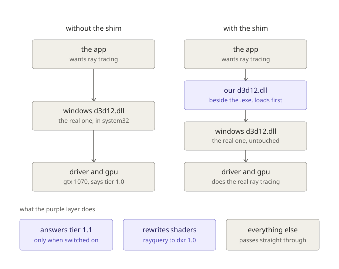

# Using the shim

Step by step, from a clean checkout to a running application.



Worth understanding before anything else: the shim is a DLL that sits beside
the application's .exe, because Windows searches that directory before
`System32`. Nothing is installed and nothing in `System32` is touched. The real
runtime, the driver and the GPU are all untouched, and the GPU still does every
ray.

## 1. What you need

- Windows x64 and a GPU that reports `D3D12_RAYTRACING_TIER_1_0`. NVIDIA
  Pascal (GTX 10-series) or Turing GTX 16-series, with a driver from 425.31
  (April 2019) or newer
- MSVC. The build scripts find it through `vswhere`, so any terminal works
- The [DirectX Shader Compiler](https://github.com/microsoft/DirectXShaderCompiler)
  and the [D3D12 Agility SDK](https://devblogs.microsoft.com/directx/directx12agility/)

Nothing from NVIDIA or Microsoft ships in this repository. You supply DXC and
the Agility SDK yourself, and the paths are set at the top of the build
scripts. The defaults expect them at `C:\DW\DXC` and
`C:\DW\microsoft.direct3d.d3d12.1.619.5`.

## The short way

`tools\dxr-tier-11-setup.bat` does steps 2 to 4 for you: pick the .exe, click
Install, and the settings and the log are on the same window. It copies files
and writes a two line .ini, nothing else, and it is a readable PowerShell
script if you want to check that before running it.

The rest of this page is the same thing by hand, and is worth reading when
something does not work.

## 2. Build

```
build_proxy.bat
```

That produces `d3d12.dll` in the repository root. It is the whole shim: the
DXIL rewriter and its DXC host are linked in, so there is nothing else to
deploy.

## 3. Install it next to the application

A proxy DLL works by sitting in the same directory as the executable, so
Windows loads it before the real `d3d12.dll` in `System32`.

```
copy d3d12.dll "<directory containing the .exe>"
```

**It must be beside the .exe itself**, not beside a launcher and not in the
game or project root. For Unreal that usually means:

| What you are running | Where the .exe is |
|---|---|
| Unreal Editor | `Engine\Binaries\Win64\UnrealEditor.exe` |
| A packaged game | `<Project>\Binaries\Win64\<Project>.exe` |

### Which files go in that directory

| File | Needed | Why |
|---|---|---|
| `d3d12.dll` | always | the shim itself |
| `dxcompiler.dll` | for RayQuery | rewrites the shader |
| `dxil.dll` | for RayQuery | signs the result, nothing runs unsigned |

Those are the only three. You do **not** need `D3D12Core.dll`, which an
application using the Agility SDK ships for itself, and you do **not** need
`d3d12SDKLayers.dll`, which is only for the debug layer and comes from the
Graphics Tools optional Windows feature.

The two DXC files are loaded **lazily**, only when a RayQuery shader actually
arrives, and by FULL PATH from beside the shim. A plain DXR 1.0 application
never touches them. The full path matters: a bare load by name would find the
application's own copy of DXC, of whatever version, which is not the one this
was built against.

**Without them, Tier 1.1 is not reported at all.** Claiming Tier 1.1 is a
promise to translate RayQuery, and that promise cannot be kept without DXC. So
the shim checks, and says so rather than letting an application discover it at
the first shader:

```
[dxr-tier-11-proxy-log] NOT reporting Tier 1.1: dxcompiler.dll is not next to the shim
... Tier 1.0 is reported instead, which is honest, and the application will
simply not use inline ray tracing.
```

The application then behaves exactly as it would with no shim present, which is
a working program without ray tracing rather than a crash.

### Where to get DXC

Download a release from Microsoft and copy `dxcompiler.dll` and `dxil.dll`
out of `bin\x64\`:

- https://github.com/microsoft/DirectXShaderCompiler/releases

They are not redistributed here on purpose. `dxil.dll` in particular is a
Microsoft binary with its own terms, so you get it from Microsoft.

**Which version.** This was built and tested against DXC 1.10.2605.37, the
`dxc_2026_08_11` release. A newer one should work and is the better default:
DXIL is pinned to LLVM 3.7 bitcode so the text format does not move between
versions, Microsoft only ever appends `dx.op` opcode numbers rather than
renumbering them, and the rewriter refuses any opcode it does not recognise
rather than guessing, so a newer compiler produces a clean refusal in the
worst case and not a wrong shader.

An OLDER one may not work. `dxil.dll` cannot sign a shader model newer than
itself, and a mismatched `dxcompiler.dll` and `dxil.dll` pair can fail
validation. Take both files from the same release.

**Only one version has actually been tested.** If something fails at signing
or validation, the version you used is the first thing to say in a bug report.

## 4. It is already on

There is no fourth step. Tier 1.1 is reported by default, because putting the
DLL there was the opt-in. Launch the application however you normally do, from
Steam, from the Epic launcher, from Explorer. Nothing needs a terminal.

### Turning it off, or changing anything

Copy `dxr-tier-11.example.ini` into the same directory, rename it to `dxr-tier-11.ini` and
edit it. A file beside the DLL is the only mechanism that works regardless of
how the application is launched, since an environment variable set in a console
never reaches a game started by a launcher.

```ini
tier11 = 0
```

Environment variables of the same name still work and take priority over the
file, which is what the test scripts use:

```
set DXR_TIER11=0
```

### The whole switch list

The shim reads six settings. It also reads five diagnostics, `rqstub`,
`rqphase`, `rqlimit`, `rqonly` and `rqdispatch`, which are bisects for chasing
a crash and make rendering wrong on purpose; they are described at the end of
[dxr-tier-11.example.ini](../dxr-tier-11.example.ini) and are not part of normal use.

| Setting | Default | Read by | What it does |
|---|---|---|---|
| `tier11` / `DXR_TIER11` | **on** | d3d12.dll | report Tier 1.1 and rewrite RayQuery shaders |
| `nowrap` / `DXR_TIER11_NOWRAP` | off | d3d12.dll | hand the application the real device and translate nothing |
| `log` / `DXR_TIER11_LOG` | `%TEMP%` | both | where to put the log file |
| `dump` / `DXR_TIER11_DUMP` | off | d3d12.dll | write refused and lowered shaders to a folder, for diagnosis and offline replay |
| `spoof` / `DXR_TIER11_SPOOF` | **on** | dxgi.dll | report a Pascal card under a Turing device id |
| `spoofid` / `DXR_TIER11_SPOOFID` | `0x1F08` | dxgi.dll | which device id to report |

Each can be set in `dxr-tier-11.ini` beside the DLL, or as an environment variable of
the upper-case name. The environment wins, so a stray `.ini` can never change
what the test scripts measure. The first two take `1/true/on/yes` or
`0/false/off/no`; the third is a path.

**The device id spoof** is what makes this work in Unreal at all, and it is
the one thing here that changes an answer rather than translating a shape.

Unreal refuses ray tracing on Pascal by PCI device id, and it does that AFTER
accepting the Tier 1.1 answer. Five lines of stock engine code, no cvar and no
command line flag to turn it off. So without `dxgi.dll` in the folder, the
whole shim reports the tier correctly and then nothing happens.

Only the device id changes, and only on the cards Unreal itself lists. The
card's name, its vendor and every capability answer stay exactly as they are:
Unreal asks NVAPI what the hardware can DO, and every one of those questions
still goes to the real 1070 and gets the real answer. Shader execution
reordering, for instance, correctly reports unsupported.

**The log location** accepts a folder as well as a file name, and puts the
usual name inside a folder. A relative path is relative to the game folder, not
to whatever directory the game happened to start in, which for a Steam or Epic
launch is not something you can predict. If the path cannot be opened the log
goes to `%TEMP%` and says so on its first line, rather than disappearing. The
setup tool has a box for it, and its `Open the log` button follows it.

`NO_WRAP` is not a companion to the first one, it overrides it. Everything the
shim does lives on the device object it hands the application, including the
Tier 1.1 answer, so refusing to hand over that object switches the whole layer
off. With `NO_WRAP` set the application sees Tier 1.0 whatever else you set.

That leaves these states:

| DLL beside the .exe | `tier11` | `nowrap` | The application sees |
|---|---|---|---|
| no | | | Tier 1.0 |
| yes | default, or 1 | off | **Tier 1.1, shaders rewritten** |
| yes | 0 | off | Tier 1.0 |
| yes | anything | **1** | Tier 1.0, shim loaded but inert |

## 5. Read the log

Every run writes `%TEMP%\dxr-tier-11-proxy.log`. Open it first, always. It is the
only thing that tells you what the shim actually did.

```
type %TEMP%\dxr-tier-11-proxy.log
```

A healthy start looks like this:

```
10:20:00.499 [dxr-tier-11-proxy-log] ======== start: MyGame.exe (pid 4872), shim 0.15.0 ========
10:20:00.840 [dxr-tier-11-proxy-log] DXC:     dxcompiler 1.10.2605.37, dxil 1.10.2605.37
10:20:00.840 [dxr-tier-11-proxy-log] runtime: D3D12Core.dll 1.619.5.0 (C:\MyGame\D3D12\D3D12Core.dll)
10:20:00.840 [dxr-tier-11-proxy-log] runtime: d3d12SDKLayers.dll not loaded, so the debug layer is off, which is normal
10:20:00.840 [dxr-tier-11-proxy-log] runtime: the real d3d12.dll 6.2.26100.9278 (C:\WINDOWS\system32\d3d12.dll)
10:20:01.128 [dxr-tier-11-proxy-log] device wrapping enabled
10:20:01.128 [dxr-tier-11-proxy-log] device wrapper created (real=..., Device6=yes, Device7=yes, tier=1.0)
10:20:01.128 [dxr-tier-11-proxy-log] highest device interface available: ID3D12Device15 (this shim implements up to 15)
10:20:01.128 [dxr-tier-11-proxy-log] reporting Tier 1.1 to the application (tier11 on, from default).
10:20:01.497 [dxr-tier-11-proxy-log] queue hook installed: vtable ... slot 10, self-test passed
```

(the date is on each line too, dropped here for width)

The `start` line proves the shim loaded at all, and says which build and which
executable. If the file does not exist, the DLL is in the wrong directory and
nothing else in this guide matters.

**The log is appended to, not replaced**, so a crash leaves its evidence behind
rather than being overwritten by the next launch. Find the last `start` marker
and read from there. Every run ends with a matching one:

```
10:24:31.002 [dxr-tier-11-proxy-log] ========= end: MyGame.exe (pid 4872) =========
```

**A missing `end` marker is a finding, not a gap.** It means the process never
unloaded the shim, which is what a crash looks like from in here. The last line
before it is where to look.

### The four DLLs that are not ours

The `DXC:` and `runtime:` lines report what the PROCESS actually loaded, which
is not always what you think you installed. Two things decide whether a run
works and neither is this project's code:

- **`dxcompiler.dll` and `dxil.dll`** convert the shader and sign it. Without
  them nothing is rewritten and the shim stands aside entirely.
- **`D3D12Core.dll`** is the application's own Agility SDK runtime, if it ships
  one. Unreal does. It is usually in a `D3D12` subfolder rather than beside the
  exe, which is why the full path is logged: the same file name arrives from
  System32, from beside the exe, or from that subfolder, and which one it was
  is exactly the question a differing result raises.

The setup tool shows the same five files, read off disk, before anything is
launched. The two answer different questions: the panel says what is installed,
the log says what was loaded.

Then, when a RayQuery shader arrives:

```
[dxr-tier-11-proxy-log] CreateComputePipelineState: shader USES RAYQUERY (SFI0 bit 20), 4812 bytes.
[dxr-tier-11-proxy-log] RayQuery compute shader lowered and ready: 4812 -> 8948 bytes, numthreads(8,8,1)
```

or, when it cannot be lowered:

```
[dxr-tier-11-proxy-log] RayQuery compute shader NOT lowered: <the reason>
```

A refused shader is forwarded unchanged, so the driver reports its own error
rather than the shim inventing one. The reason line is the useful part.

## 6. Check it is actually working

Before trusting it on a real application, run the suites. They take ground
truth from WARP on every run, so they test your build on your machine rather
than comparing against a stored baseline.

```
tools\run_dispatch_test.ps1     RayQuery shaders end to end through the proxy
tools\run_rewriter_test.ps1     the rewriter, and Python/C++ agreement
```

Both should end with every case passing and every gate behaving: 23 render
cases and 4 gates in the first, 13 render cases and 15 analysis and lowering
checks in the second.

## 7. When something goes wrong

Work down this list in order. Each step rules out a layer.

**No log file at all.** The DLL is not beside the .exe, or the application
loads D3D12 from somewhere else. Confirm the .exe path, and confirm you copied
to that directory and not to the project root.

**The log exists but stops after the `start` marker.** The application never
created a D3D12 device. Something failed earlier, unrelated to the shim.

**Is the shim the problem at all?** Set `DXR_TIER11_NOWRAP=1`. That disables
device wrapping and restores plain forwarding while leaving the DLL in place.
If the symptom persists, it is not the shim's translation. If it clears, it
is, and the log says what was being translated when it happened.

**Rendering is wrong rather than broken.** Search the log for `REFUSED` and
for `NOTE:`. The shim refuses what it cannot serve, and it also warns about
scene layouts it can only partly serve.

**A shader is refused.** The reason is in the log, in full. The README splits
them into two lists, and the difference matters when you are deciding whether
to report it: refusals that are facts about DXR 1.0 will not change, and
refusals that are gaps in the rewriter will. "More than one RayQuery object"
is the second kind and is the most common one a real game hits. "Proceed loop
body has a side effect" is the first kind: DXR lets an any-hit shader run more
than once for the same candidate, so a UAV write or counter append moved into
one would not be the same write.

Turn `dump` on and the refused shader is written out as a `.dxil` container
with a `.txt` saying why, which is what makes a useful bug report.

**The device is removed while shaders are being created**
(`DXGI_ERROR_DRIVER_INTERNAL_ERROR`, often with no error from the shim at
all). Look at the last lines of the log. Every state object build is announced
BEFORE the call, so if the log ends on `about to call CreateStateObject`, that
call is where the device went.

One cause is known and fixed. Up to 0.36.x the shim passed each hit group
record's geometry index and instance contribution through a local root
signature, and on Pascal a hit shader READING a local root signature makes the
driver crash inside `CreateStateObject`, intermittently, and only when NVIDIA's
shader cache does not already hold the result. From 0.37.0 those values are
baked into a copy of the hit shaders per record instead, and the log line says
how many copies each build carries. If you see this on 0.37.0 or later it is a
different cause: turn `dump` on, and the library that was being built is on
disk as `lowered_NNN.*` and can be rebuilt on its own with `sotest`, see
`phase5/cases/driver-crash/README.md`. Because the crash can depend on the
cache, one clean run of a library proves little; clear
`%LOCALAPPDATA%\NVIDIA\DXCache` before each attempt and count.

**Turn the D3D12 debug layer on.** The shim does not switch this itself, and
it does not need to: `dxcpl.exe`, the DirectX Control Panel, forces the debug
layer on for any executable you name. It comes with the Graphics Tools
optional Windows feature (Settings, Optional features, Add a feature, Graphics
Tools). Add the target .exe to its list and enable the debug layer there.

The layer reports through `OutputDebugString`, so its messages do NOT appear in
a console or in `dxr-tier-11-proxy.log`. Read them with DebugView or a debugger
attached to the process.

`DXR_TIER11_DEBUGLAYER=1` turns it on in this project's own test harness, where the
messages are drained into stdout. That variable does nothing for the shim.

**A warning about reading anything into its silence.** The debug layer does not
police everything. It is measurably silent on hit group and geometry type
mismatches, including a case this project confirmed was producing wrong output.
An oracle that says nothing has to be shown capable of saying something before
its silence counts as a result.

## 8. Turning it off

Three levels, increasing in thoroughness:

| Goal | Do this |
|---|---|
| Report Tier 1.0 again, keep the shim loaded | `tier11 = 0` in `dxr-tier-11.ini` |
| Forward everything, translate nothing | `nowrap = 1` in `dxr-tier-11.ini` |
| Remove the shim entirely | delete `d3d12.dll` from the .exe's directory |

Deleting the DLL always restores the original behaviour exactly. The shim adds
no registry keys, no services and no files outside its own directory and the
log in `%TEMP%`.

## 9. Notes for Unreal

Unreal ships its own Agility SDK, which redirects D3D12 to a `D3D12Core.dll`
in a subdirectory. That works with this shim: the proxy exports the three
undocumented `D3D12Core*` entry points that `d3d12SDKLayers.dll` imports, so
the Agility runtime and the debug layer both still load.

Epic's RayQuery use is all in compute shaders, which is the shape this shim
handles, and **all 25 of the accessors Epic uses are now supported**. Four of
them were listed as impossible for a long time and are not.

This is no longer only a source survey. Shaders dumped out of a running UE
5.8.2 game have been through the whole path, and one of them lowers, validates
and signs. Expect some shaders to still be refused, most of them for having
more than one RayQuery object in an entry point, and the log will name each
one. `dump = refused-shaders` writes them out so a refusal can be reproduced
offline with `dxrw rewrite`.

**Where a real Unreal game stands today, stated plainly.**

- **A refused shader ends the game.** The shim forwards a shader it cannot
  lower, the driver rejects it, and Unreal turns that into
  `LowLevelFatalError ... Shader compilation failures are Fatal`. So a full
  run of an Unreal game currently stops at the first refused RayQuery shader.
  In one UE 5.8.2 game with 163 RayQuery shaders, the last run lowered 19 of
  the first 43 it reached before the GPU crash stopped it; how many of all 163
  lower is not yet measured. The diagnostics `rqphase` and `rqstub` keep such
  a game running by handing refused shaders a pipeline that does nothing,
  which is useful for testing and renders wrong.
- **The GPU crash during pipeline creation is fixed in 0.37.0**, see section
  7. The libraries that game produced now build cleanly on a GTX 1070 offline;
  a run of the game itself with 0.37.0 is the next check.
- **A pass dispatched indirectly does nothing, silently.** Unreal dispatches
  many Lumen and MegaLights inline passes with a compute `DispatchIndirect`,
  and the shim emulates only a DIRECT `Dispatch` of a lowered pipeline so far.
  An indirect one runs the do-nothing stand-in, so that pass draws nothing even
  though its shader lowered, and nothing in the log says so yet.
- `dxgi.dll` is required, not optional: without it Unreal reads the Pascal
  device id and switches ray tracing off before any of this happens.
- Expect it to be slow. Pascal traces rays on its shader cores, and Epic's own
  refusal of Pascal most likely exists for that reason.
